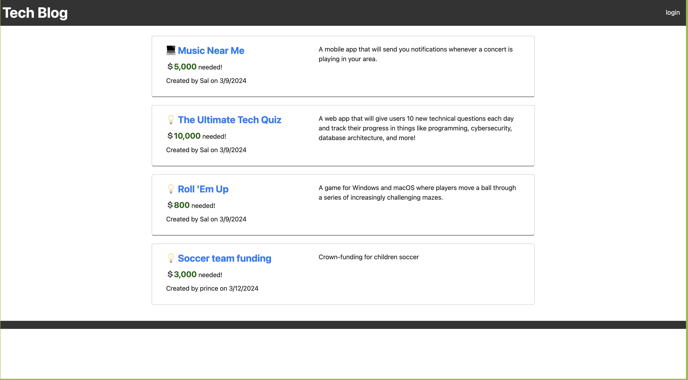

# Model-View-Controller (MVC): Tech Blog

## Overview

This project is a Tech Blog built using the Model-View-Controller (MVC) architectural pattern. 
The application allows users to create accounts, publish blog posts, comment on posts, and interact with other users' content. 
By separating the application logic into distinct components - the Model (database interactions), View (user interface), and Controller (business logic) - this project aims to provide a scalable and maintainable solution for managing a tech-centric blogging platform.

## Features

User Authentication: Users can sign up for accounts and log in securely.

Create and Edit Posts: Authenticated users can create new blog posts and edit their existing posts.

Commenting System: Users can leave comments on blog posts to engage in discussions.

User Profile: Each user has a profile page displaying their published posts and comments.

Session Management: User sessions are managed securely to maintain login states.

## Mockup

## Technologies Used

Node.js: Backend JavaScript runtime environment.

Express.js: Web application framework for Node.js.

MySQL: Relational database management system.

Sequelize: ORM (Object-Relational Mapping) for Node.js.

Handlebars.js: Template engine for HTML rendering.

bcrypt: Password hashing library for user authentication.

Express-Session: Middleware for managing user sessions.

dotenv: Module for loading environment variables from a .env file.

## Installation

Clone the repository: git clone https://github.com/MFKAMARA/tech_blog

Navigate to the project directory: cd tech-blog

Install dependencies: npm install

Set up the database:

Create a .env file based on the provided .env.example.

Configure your MySQL database credentials in the .env file.

Run the database schema migrations: npm run migrate

Start the server: npm start

Visit http://localhost:3000 in your web browser to access the Tech Blog.

## Usage

Register for a new account or log in if you already have one.

Create new blog posts or edit existing ones from your profile page.

View other users' posts and leave comments to engage in discussions.

Log out securely after you're done using the application.

## Contributing

Contributions are welcome! If you'd like to contribute to this project, please follow these steps:

Fork the repository.

Create a new branch (git checkout -b feature/your-feature).

Commit your changes (git commit -am 'Add some feature').

Push to the branch (git push origin feature/your-feature).

Submit a pull request.

## License

This project is licensed under the MIT License - see the LICENSE file for details.

## Contact

Email: malikikamara@yahoo.com

GitHub: [https://github.com/MFKAMARA/tech_blog]